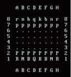

# Chess ♟️

Общая тема задания «Шахматный симулятор: объектно-ориентированная версия»

Баллы:

- Основная часть – 10 баллов
    - Выполняется всеми самостоятельно!
- Дополнительная часть – 5 баллов

## Задания

### Базовая часть

Создать объектно-ориентированную реализацию программы для игры в шахматы.

Реализовать программу, которая позволяет играть в шахматы на компьютере.
Взаимодействие с программой производится через консоль (базовый вариант).
Игровое поле изображается в виде 8 текстовых строк, плюс строки с буквенным обозначением столбцов (см. пример на Рис. 1)
и перерисовывается при каждом изменении состояния поля.
При запросе данных от пользователя программа сообщает, что ожидает от пользователя (например, позицию фигуры для
следующего хода белыми; целевую позицию выбранной фигуры) и проверяет корректность ввода (допускаются только ходы
соответствующие правилам
шахмат; поддержка рокировки, сложных правил для пешек и проверки мата вынесена в отдельные пункты).
Программа должна считать количество сделанных ходов.

Рис. 1 – Пример изображения шахматного поля в текстовом режиме

Сама программа НЕ ходит: т.е. не пытается выполнить ходы за одну из сторон, а предоставляет поочередно вводить ходы за
белых и черных.

### Требования к реализации

Основные объекты и абстрактные сущности игры должны быть представлены в виде объектов, представителей соответствующих
классов, часть классов должны быть организованы в виде иерархии.
В частности: шахматные фигуры – объекты, представители классов, организованных в виде иерархии; доска – объект; ходы
фигур – объекты.
Вся основная информация должна храниться в атрибутах объектов или классов (например, информация о положении фигур, цвете
фигур, символах, используемых для визуализации фигур и т.п.).
Основная часть функционала программы должна быть организована в виде методов, закрепленных за соответствующими
объектами или классами.
Например, это касается методов определяющих допустимые ходы фигур.
Организация иерархий классов, атрибутов и методов должна позволять гибко расширять возможности программы с минимальными
изменениями в уже созданном коде.

### Дополнительные задания

#### 1. Сложность 1

Придумать 3 новых вида фигур с оригинальными правилами перемещения и реализовать их классы. Создать модификацию шахмат с
новыми фигурами с минимальным вмешательством в существующий код.

#### 2. Сложность 2

На базе игры в шахматы реализовать игру в шашки. Разработать модификацию шахмат с минимальным вмешательством в
существующий код.

#### 3. Сложность 3

На базе игры в шахматы на классической доске реализовать игру
в [гексагональные шахматы](https://ru.wikipedia.org/wiki/Гексагональные_шахматы).
Выбрать один из трех вариантов:

- Шахматы [Глинского](https://ru.wikipedia.org/wiki/Гексагональные_шахматы_Глинского)
- Шахматы [МакКуэя](https://ru.wikipedia.org/wiki/Гексагональные_шахматы_Глинского#Шахматы_МакКуэя)
- Шахматы [Шафрана](https://ru.wikipedia.org/wiki/Гексагональные_шахматы_Шафрана)

Разработать модификацию шахмат с минимальным вмешательством в существующий код для обычных шахмат.

#### 4. Сложность 4

На базе игры в шахматы на классической доске реализовать игру
в [гексагональные шахматы на троих](https://ru.wikipedia.org/wiki/Шахматы_для_троих).
Выбрать один из существующих вариантов.
Разработать модификацию шахмат с минимальным вмешательством в существующий код для обычных шахмат.

#### 5. Сложность 1

Реализовать возможность «отката» ходов.
С помощью специальной команды можно возвращаться на ход (или заданное количество ходов) назад вплоть до начала партии.
Информация о ходах в партии должна храниться в объектно-ориентированном виде.

#### 6. Сложность 1

Реализовать функцию подсказки выбора новой позиции фигуры: после выбора фигуры для хода функция визуально на поле
показывает поля, доступные для хода, или фигуры соперника, доступные для взятия выбранной фигурой.
Информация о допустимых ходах должна храниться в объектно-ориентированном виде, алгоритм без модификации должен работать
при добавлении новых типов фигур.

#### 7. Сложность 1

Реализовать функцию подсказки угрожаемых фигур: она возвращает информацию о том, какие фигуры ходящего игрока сейчас
находятся под боем (т.е. могут быть взяты соперником на следующий ход) и визуально выделяет их на поле.
Функция отдельно указывает на наличие шаха королю.
Информация о допустимых ходах должна храниться в объектно-ориентированном виде, алгоритм без модификации должен работать
при добавлении новых типов фигур.

#### 8. Сложность 1

Реализовать поддержку для пешки [сложных правил](https://ru.wikipedia.org/wiki/Правила_шахмат): «взятие на проходе» и
замены на других фигуру при достижении крайней горизонтали (в базовой версии их поддержка не обязательна, но возможность
первого хода на одну или две горизонтали - обязательно).
Информация о допустимых ходах должна храниться в объектно-ориентированном виде, алгоритм без модификации
должен работать при добавлении новых типов фигур со сложным поведением (задание берется совместно с Заданием 1 и как
минимум одна из новых фигур должна иметь сложное поведение, т.е. изменение правил хода и взятия фигуры в зависимости от
дополнительных условий).